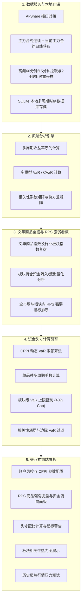

# 商品期货 VaR 头寸资金管理系统 (Commodity Futures VaR Position Manager)

本系统是专为商品期货资深交易员设计的头寸与资金管理工具，核心基于 **Value at Risk (VaR)** 和 **Expected Shortfall (CVaR)** 模型，通过控制“风险资本（回撤额度）”来实现科学的头寸控制，并集成 CPPI 动态风控和三重防共振机制。同时，系统配备文华商品全览与板块/品种 RPS 强弱分析看板，辅助交易员进行品种筛选。

> [!IMPORTANT]
> **项目管理规范**：
> 1. 本文件（`README.md`）为本项目的总纲，需交易员确认批准。未来的任何改动均需交易员明确授权。
> 2. 项目后续每完成一个模块的开发，必须在根目录下生成一个该模块的专用说明文档（如 `docs/module_name.md`），详述该模块实现的内容与功能，便于进度确认。
> 3. **Markdown 渲染规范**：为了确保所有 `.md` 文档在 GitHub 上完美显示，必须遵守以下格式规范：
>    - **数学公式**：统一使用 GitHub 支持的 `$`（行内）和 `$$`（独立块）语法，**严禁**使用 `\[ \]` 或 `\( \)`。此外，`$$` 公式块的前后**必须留有空行**。
>    - **公式中的百分号**：LaTeX 中的 `%` 是注释符。在部分 Markdown 渲染环境下，即使写为 `\%`，也容易导致公式尾部的 `}` 或 `$` 被当做注释吃掉，从而报 `Extra open brace or missing close brace` 错误。因此，**严禁在 `$` 或 `$$` 内部使用百分号 `%`**。请将百分号移至公式外部（如 `5% $\sim$ 10%`），或在公式内用纯数字代替（如 `_{99}`）。
>    - **段落隔离**：所有的列表（`-` 或 `*`）、代码块（` ``` `）和表格前后，均需**留有一个空行**以防止排版粘连。
>    - **Mermaid 绘图**：在编写 Mermaid 图表（如流程图）时，如果节点标签中包含特殊字符（如括号 `()`、百分号 `%` 等），**必须使用双引号将标签文本括起来**（例如 `id["Label (Extra Info)"]`），以防止 GitHub 渲染解析报错。

---

## 一、 头脑风暴与核心风控设计总结

经过前期的深度讨论，我们确立了系统的风控底座：

### 1. 核心公式：基于风险资本（回撤额度）的 VaR 比例确定
每日 VaR 的限额不由账户总资金（名义本金）决定，而是由**账户实际可承受的最大回撤额度（风险资本）**决定。

$$\text{Daily VaR}_{99} = k \times D$$

* **$D$ (Drawdown Budget)**：最大回撤额度（例如：100万本金，清盘线 80万，则 $D = 20$ 万；若 100万可亏光，则 $D = 100$ 万）。
* **$k$ (Risk Factor)**：风险偏好系数，推荐范围为 **5% $\sim$ 10%**。
  * **7.5% 为黄金平衡点**：使年化波动率保持在 10% 左右，预期最大回撤与回撤额度 $D$ 完美匹配，一年内触及清盘线的概率极低（约 10%）。
  * 账户可以 100% 亏光时，则 $D = 100$ 万，日 VaR 上限自动调整为 7.5 万。

### 2. 置信度选型：99% 置信度
系统采用 **1天 99% 置信度** 作为基准风险度量。
* **原因**：95% 置信度会频繁（月均 1-2 次）超出限制，容易引发风控焦虑，且无法有效捕获商品期货跳空和暴涨暴跌的尾部极端风险；99% 置信度对极端风险的容纳性更佳，其超出情况代表真正的市场结构突变。

### 3. CPPI 动态风险预算 (Dynamic VaR)
系统支持“顺风放杠杆，逆风降头寸”的动态机制。
* 随着账户净值上升，安全垫扩大，每日 VaR 限额自动成比例调宽，享受复利爆发；
* 随着账户发生回撤，安全垫收窄，每日 VaR 限额自动收缩，建仓手数呈指数级减缓，**在数学上绝对锁死清盘底线**。

---

## 二、 系统模块架构设计（已根据交易员需求修改）

本项目共划分为五个核心功能模块：



### 1. 数据服务与本地存储模块 (`data_fetcher.py`)
* **多合约类型拉取**：同时拉取各品种的**主力合约连续数据**（拼接历史）以及**当前主力合约的实际未拼接数据**。
* **多周期支持**：支持日线级别，并为未来的两小时级别策略预留接口（通过拉取 60 分钟或 15 分钟 K 线，在本地重新融合成 2 小时K线）。
* **本地多周期时序 SQLite 数据库**：
  * 使用 **SQLite** 对品种元数据（乘数、交易所保证金率）、主力K线时序数据进行存储。
  * 数据库表结构预设：`contract_metadata` (品种信息), `kline_daily` (日K线), `kline_2h` (2小时K线)。
  * 提供增量更新接口，每日收盘后仅同步当天最新数据，避免重复拉取。

### 2. 风险分析引擎 (`risk_engine.py`)
* 计算各品种（基于日线和 2 小时线）收益率时序。
* 提供**历史模拟法 VaR**、**EWMA 动态波动率 VaR**，以及条件在险价值 **Expected Shortfall (CVaR)** 计算。
* 计算选定品种、板块指数之间的**协方差与相关系数矩阵**。

### 3. 新增：文华商品全览与 RPS 强弱复盘模块 (`market_reviewer.py`)
* **文华指数与板块复盘**：获取文华商品指数及各板块指数（建材、能化、有色、农产品等）的历史和当日涨跌幅。
* **持仓资金流入分析**：通过 **持仓量变化量 (Change in Open Interest) × 收盘价 × 合约乘数**，估算各品种及板块每日的增仓/减仓资金净流入流出额。
* **商品 RPS 强弱选择器**：
  * 借鉴欧奈尔股票 RPS 逻辑，计算商品在过去 $N$ 天（如 20天、60天、120天）的相对价格涨幅排名。
  * 在全市场范围进行 RPS 排名，挑选出最强（RPS > 90）和最弱（RPS < 10）的品种。
  * 在板块内部进行 RPS 排名，辅助交易员找出板块内的龙头与龙二，以及做空备选对象。

### 4. 资金与头寸计算引擎 (`position_calculator.py`)
* 输入参数：总资金、回撤限额、风险偏好系数 $k$、CPPI 状态。
* 支持多周期（日线 / 2小时线）对应的风险限额转换与手数计算。
* 实现板块风险上限限制（单一板块 VaR 贡献限额 40%）、高相关品种（$r > 0.7$）惩罚和边际 VaR 过滤。
* 校验总保证金占用。

### 5. 交互式前端看板 (`app.py` - 基于 Streamlit)
* **大盘复盘面板**：展示文华商品指数及各板块的每日资金流入热力图、涨跌幅明细。
* **RPS 商品筛选版面**：以表格和柱状图呈现全市场及各板块内部的 RPS 强弱排行，帮助交易员确定交易标的。
* **风险头寸计算面板**：交易员选择品种、多空方向后，根据所选周期（日线/2小时线），自动输出手数、保证金及风控预警。
* **可视化看板**：品种相关性矩阵热力图、板块 VaR 贡献扇形图。
* **极端压力测试**：模拟历史黑天鹅回撤表现。
